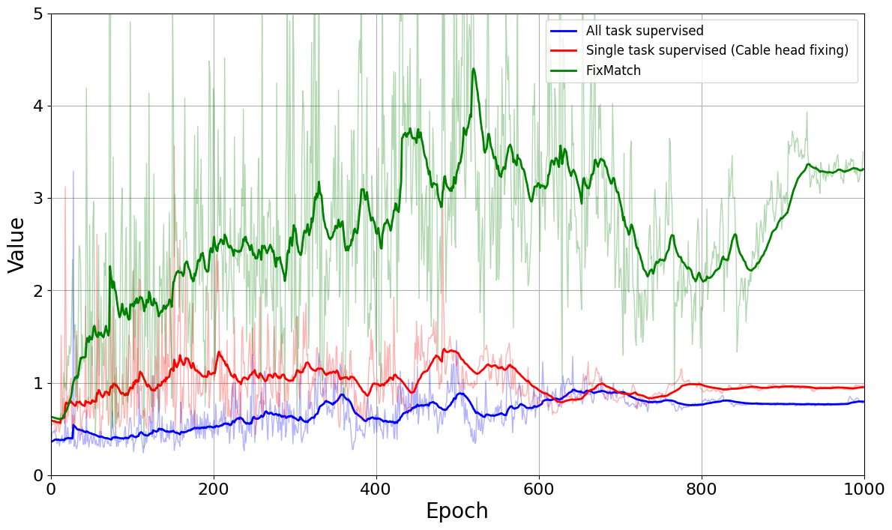

# CAB Defect Detection

This project was done as part of the miniproject for Viettel Digital Talent program under the supervision of Mr. Dinh Quang Huy from Viettel Construction department.

## Overview

This project implements various machine learning methods for detecting defects in cable box installations. The methods can support multiple task which currently included:

- **han_box**: Tray box Defects (open/close)
- **bo_chia**: Splitter Defects
- **co_dinh_cap**: Cable Head Fixing Defects

The project uses PyTorch Lightning framework and supports both supervised and semi-supervised learning approaches.

## Features

- **Multiple Learning Methods**:
  - Supervised Learning
  - FixMatch (Semi-supervised)
- **Multi-task Classification**: Support for multiple cable defect detection tasks
- **Modern Architecture**: Built with PyTorch Lightning and MobileNetV3
- **Comprehensive Metrics**: Precision, Recall, F1-score, and per-class accuracy
- **Flexible Configuration**: YAML-based configuration system

## Installation

### Prerequisites

- Python 3.11+
- CUDA-capable GPU (recommended)
- Conda or Miniconda

### Environment Setup

1. **Clone the repository**:

```bash
git clone <your-repository-url>
cd cabdefect
```

2. **Create conda environment from environment.yml**:

```bash
conda env create -f environment.yml
conda activate my_base
```

## Data Structure

### Required Directory Structure

Your dataset should follow this structure for the training and testing to work properly:

```text
data_more_label/                    # Root data directory
├── train_data/
│   ├── labeled/                    # Labeled training data
│   │   ├── han_box/               # Task 1: Junction box detection
│   │   │   ├── class1/              # Class 1: Open junction box
│   │   │   │   ├── image1.jpg
│   │   │   │   ├── image2.jpg
│   │   │   │   └── ...
│   │   │   └── class2/             # Class 2: Closed junction box
│   │   │       ├── image1.jpg
|   |   |       ├── image2.jpg
│   │   │       └── ...
│   │   ├── bo_chia/               # Task 2: Splitter box detection
│   │   │   ├── class1/
│   │   │   └── class2/
│   │   └── co_dinh_cap/           # Task 3: Cable fixation detection
│   │       ├── class1/
│   │       └── class2/
│   └── unlabeled/                 # Unlabeled training data (for semi-supervised)
│       ├── image1.jpg
│       ├── image2.jpg
│       └── ...
├── test_data/                     # Test data
│   ├── han_box/
│   │   ├── class1/
│   │   └── class2/
│   ├── bo_chia/
│   │   ├── class1/
│   │   └── class2/
│   └── co_dinh_cap/
│       ├── class1/
│       └── class2/
```

### Data Preparation Guidelines

1. **Image Requirements**:
   - Supported formats: `.jpg`, `.jpeg`, `.png`

2. **Labeled Data**:
   - Place images in appropriate task/class subdirectories
   - Ensure balanced class distribution when possible

3. **Unlabeled Data** (for semi-supervised methods):
   - Place images directly in `train_data/unlabeled/` directory
   - Can include images from any task/class
   - Used by FixMatch methods.

## Training

### Available Methods

The project provides several bash scripts for training different models:

#### 1. Supervised Learning

```bash
# Train supervised model
bash ./supervised.bash
```

#### 2. FixMatch (Semi-supervised)

```bash
# Train FixMatch model
bash ./fixmatch.bash
```

### Configuration

Training parameters can be modified in the YAML configuration files located in the `configs/` directory:

- `configs/supervised.yaml` - Supervised learning configuration
- `configs/fixmatch.yaml` - FixMatch configuration

## Model Architecture

- **Backbone**: MobileNetV3 (efficient for mobile deployment)
- **Multi-task Learning**: Separate classification heads for each task
- **Feature Extraction**: Extract the required deep features vector from the final output layers
- **Loss Functions**: Focal loss

## Evaluation Metrics

The training process tracks multiple metrics:

- **Overall Accuracy**: Percentage of correct predictions
- **Per-class Accuracy**: Accuracy for each individual class
- **Precision**: True positives / (True positives + False positives)
- **Recall**: True positives / (True positives + False negatives)
- **F1-score**: Harmonic mean of precision and recall
- **Micro/Macro averages**: Different averaging strategies

## Results and Checkpoints

Training results are automatically saved:

- **Model Checkpoints**: Saved in `lightning_logs/` directory
- **TensorBoard Logs**: Monitor training progress with `tensorboard --logdir lightning_logs`
- **Best Models**: Top 3 models saved based on validation accuracy

## Usage Examples

### Training a New Model

1. Prepare your data according to the directory structure above
2. Choose your training method:

```bash
# For supervised learning with full labels
bash ./supervised.bash
```
```bash
# For semi-supervised learning with limited labels
bash ./fixmatch.bash
```

3. Monitor training progress:

```bash
tensorboard --logdir lightning_logs
```

### Inference

To perform inference on some images do:

```bash
python infer.py
```

## Results

### Qualitative Results

The following images demonstrate the model's performance on various cable defect detection tasks by using the CAM maps:

<div align="center">
  <table>
    <tr>
      <td align="center">
        
        <br>
        <b>Single predictions with all tasks</b>
      </td>
    </tr>
    <tr>
      <td align="center">
        
        <br>
        <b>More predictions with combined mapping</b>
      </td>
    </tr>
  </table>
</div>

### Quantitative Results

The quantitative evaluation demonstrates the model's performance metrics across different tasks:

<div align="center">
  <table>
    <tr>
      <td align="center">
        
        <br>
        <b>Tray box validation loss</b>
      </td>
      <td align="center">
        
        <br>
        <b>Tray box accuracy</b>
      </td>
    </tr>
    <tr>
      <td align="center">
        
        <br>
        <b>Cable head fixing validation loss</b>
      </td>
      <td align="center">
        
        <br>
        <b>Cable head fixing accuracy</b>
      </td>
    </tr>
  </table>
</div>

The quantitative results show a slight improvement in accuracy and validation loss across validation epochs when training on multitask learning scheme compare to training on only a single tasks.

## Web Application

A simple web application has been developed for easy model deployment and testing. To run the web application:

```bash
python -m web.app
```

<div align="center">
  
  <br>
  <b>Web Application Interface</b>
</div>

The web application provides an intuitive interface for uploading images and getting predictions for cable box defect detection.

